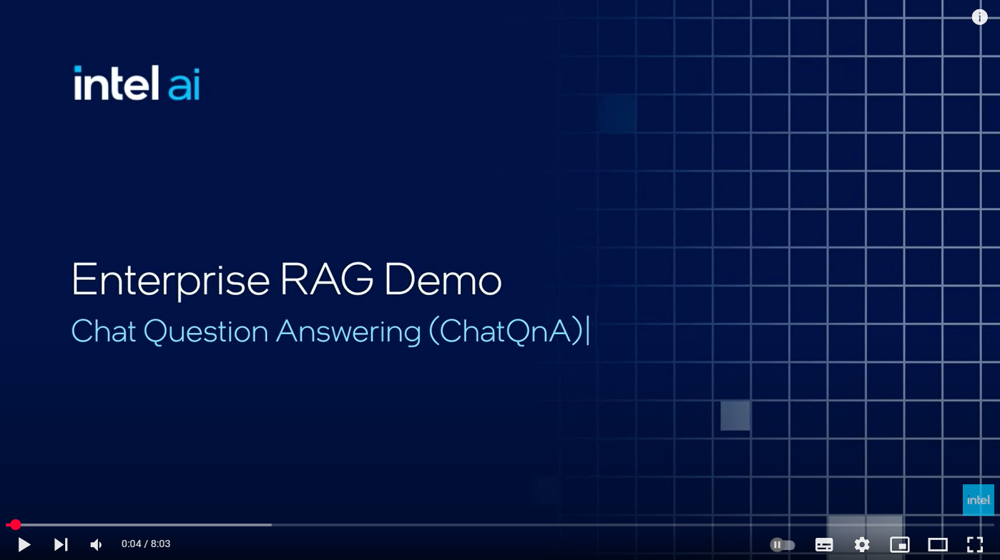
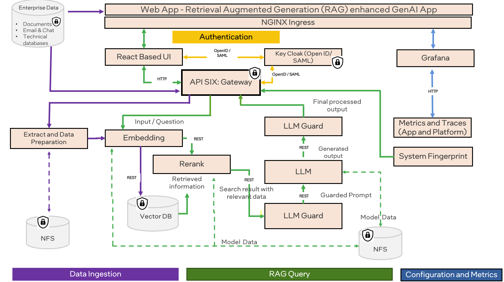

# Intel® AI for Enterprise RAG

<div align="center">
  <a href="https://www.youtube.com/watch?v=wWcUNle1kkg">
    
  </a>
</div>
&nbsp;

Intel® AI for Enterprise RAG simplifies transforming your enterprise data into actionable insights. Powered by Intel® Gaudi® AI accelerators and Intel® Xeon® processors, it integrates components from industry partners to offer a streamlined approach to deploying enterprise solutions. It scales seamlessly with proven orchestration frameworks, providing the flexibility and choice your enterprise needs.

Building on the strong foundation of OPEA, Intel® AI for Enterprise RAG extends this base with key features that enhance scalability, security, and user experience. These include integrated Service Mesh capabilities for seamless integration with modern service-based architectures, production-ready validation for pipeline reliability, and a feature-rich UI for RAG as a service to manage and monitor workflows easily. Additionally, Intel® and partner support provide access to a broad ecosystem of solutions, combined with integrated IAM with UI and application, ensuring secure and compliant operations. Programmable guardrails enable fine-grained control over pipeline behavior, allowing for customized security and compliance settings.

> [!NOTE]
The video provided above showcases the beta release of our project. As we transition to the 1.0 version, users can anticipate an improved UI design along with other minor enhancements. While many features remain consistent with the beta, the 1.0 release will offer a more refined user experience.

**ChatQnA**

The ChatQnA solution uses retrieval augmented generation (RAG) architecture, quickly becoming the industry standard for chatbot development. It combines the benefits of a knowledge base (via a vector store) and generative models to reduce hallucinations, maintain up-to-date information, and leverage domain-specific knowledge.



For the complete microservices architecture, refer [here](./docs/microservices_architecture.png)
<div align="left">
    <a href="https://opea.dev/" target="_blank">
    
  </a>
</div>

# Table of Contents

- [Documentation](#documentation)
- [System Requirements](#system-requirements)
- [Installation](#installation)
- [Support](#support)
- [License](#license)
- [Security](#security)
- [Trademark Information](#trademark-information)

# Documentation

* [Deployment Guide](deployment/README.md) explains how to install and configure Intel® AI for Enterprise RAG for your needs.

# System Requirements

| Category            | Details                                                                                                           |
|---------------------|-------------------------------------------------------------------------------------------------------------------|
| Operating System    | Ubuntu 20.04/22.04                                                                                                |
| Hardware Platforms  | 4th Gen Intel® Xeon® Scalable processors<br>5th Gen Intel® Xeon® Scalable processors<br>6th Gen Intel® Xeon® Scalable processors<br>3rd Gen Intel® Xeon® Scalable processors and Intel® Gaudi® 2 AI Accelerator<br>4th Gen Intel® Xeon® Scalable processors and Intel® Gaudi® 2 AI Accelerator <br>6th Gen Intel® Xeon® Scalable processors and Intel® Gaudi® 3 AI Accelerator|
| Kubernetes Version  | 1.29.5 <br> 1.29.12 <br> 1.30.8 <br> 1.31.4                                                                        |
| Gaudi Firmware Version | 1.20.0

## Hardware Prerequisites for Deployment using Gaudi® AI Accelerator

To deploy the solution on a platform with Gaudi® AI Accelerator we need to have access to instance with minimal requirements:

-  **logical cores**: A minimum of `48` logical cores
-  **RAM memory**: A minimum of `250GB` of RAM though this is highly dependent on database size
-  **Disk Space**: `1TB` of disk space is generally recommended, though this is highly dependent on the model size and database size
-  **Gaudi cards**: `8`
-  **Latest Gaudi driver**: To check your Gaudi version, `run hl-smi`. If Gaudi version doesn't match the required version, upgrade it by following [this tutorial](https://docs.habana.ai/en/latest/Installation_Guide/Driver_Installation.html).


If you don't have a Gaudi® AI Accelerator, you can request these instances in [Intel® Tiber™ AI Cloud](https://console.cloud.intel.com/home) to run Intel® AI for Enterprise RAG.

- visit [Intel® Tiber™ AI Cloud](https://console.cloud.intel.com/home).
- In the left pane select `Catalog > Hardware`.
- Select `Gaudi® 2 Deep Learning Server` (recommended). `Gaudi® 2 Deep Learning VM` is also available but due to its resource limitation it is not recommended.
- Select Instance Type - for best performance we recommend choosing a Bare Metal machine with 8 Gaudi devices.
- Select the Machine image - for example: `ubuntu-2204-gaudi2-1.19.1-*` with `Architecture: X86_64 (Baremetal only)`. Please note that minor version tags may change over time.
- Upload your public key and launch the instance
- Navigate to the `Instances` page and verify that the machine has reached its ready state, then click on "How to Connect via SSH" to configure your machine correctly for further installation.

> [!NOTE]
> If you don't see any of the options above, you can either
> - request the access to the instances by selecting `Preview > Preview Catalog`
> - chat with Intel® Tiber™ AI Cloud agent by selecting question mark button in top right corner.

## Hardware Prerequisites for Deployment using Xeon only
To deploy the solution on a platform using 4th or 5th generation Intel® Xeon® processors, you will need:
- access to any platform with Intel® Xeon® Scalable processors that meet bellow requirements:
-  **logical cores**: A minimum of `80` logical cores
-  **RAM memory**: A minimum of `250GB` of RAM
-  **Disk Space**: `500GB` of disk space is generally recommended, though this is highly dependent on the model size

### Software Prerequisites

Refer to the [prerequisites](./docs/prerequisites.md) guide for detailed instructions to install the components mentioned below:

-   **Kubernetes Cluster**: Access to a Kubernetes v1.29-v1.31 cluster
-   **CSI Driver**: The K8s cluster must have the CSI driver installed. Users can define their own CSI driver that will be used during EnterpriseRAG install; however StorageClass provided by CSI driver should support ReadWriteMany(RWX) in case of using a multi-node cluster.
- Current solution was tested on a single node using the CSI driver [local-path-provisioner](https://github.com/rancher/local-path-provisioner), with  `local_path_provisioner_claim_root`  set to  `/mnt`. For an example of how to set up Kubernetes via Kubespray, refer to the prerequisites guide:  [CSI Driver](./docs/prerequisites.md#csi-driver).
-   **Operating System**: Ubuntu 20.04/22.04
-   **Hugging Face Model Access**: Ensure you have the necessary access to download and use the chosen Hugging Face model. This default model used is `Mixtral-8x7B` for which access needs to be requested. Visit  [Mixtral-8x7B](https://huggingface.co/mistralai/Mixtral-8x7B-Instruct-v0.1) to apply for access.

#### Additional Software Prerequisites when using Gaudi® AI Accelerator
-   **Gaudi Software Stack**: Verify that your setup uses a valid software stack for Gaudi accelerators, see  [Gaudi support matrix](https://docs.habana.ai/en/latest/Support_Matrix/Support_Matrix.html). Note that running LLM on a CPU is possible but will significantly reduce performance.
-   **Prepared Gaudi Node**: Please refer to the [Gaudi Software Stack](./docs/prerequisites.md#gaudi-software-stack) section of the prerequisites section.

# Installation

```sh
cd deployment
./one_click_chatqna.sh -g HUG_TOKEN [-p HTTP_PROXY] [-u HTTPS_PROXY] [-n NO_PROXY] -d [PIPELINE] -t [TAG] -y [REGISTRY] [--features FEATURES]
```

> [!NOTE]
> In case we are deploying the solution on `Xeon`, please change the `PIPELINE` parameter to the pipeline dedicated for Xeon, for example, `xeon_torch_llm_guard`. For more information, refer to [Configure Pipeline](docs/configure_pipeline.md).

Proxy variables are optional.
Refer [Deployment](deployment/README.md) if you prefer to install with multiple options.

# Remove installation

```sh
cd deployment
./install_chatqna.sh -ca
```

# Support

Submit questions, feature requests, and bug reports on the GitHub Issues page.

# License

Intel® AI for Enterprise RAG is licensed under the [Apache License Version 2.0](LICENSE). Refer to the "[LICENSE](LICENSE)" file for the full license text and copyright notice.

This distribution includes third-party software governed by separate license terms. This third-party software, even if included with the distribution of the Intel software, may be governed by separate license terms, including without limitation, third-party license terms, other Intel software license terms, and open-source software license terms. These separate license terms govern your use of the third-party programs as set forth in the "[THIRD-PARTY-PROGRAMS](THIRD-PARTY-PROGRAMS)" file.

# Security

The [Security Policy](SECURITY.md) outlines our guidelines and procedures for ensuring the highest level of security and trust for our users who consume Intel® AI for Enterprise RAG.

# Trademark Information

Intel, the Intel logo, OpenVINO, the OpenVINO logo, Pentium, Xeon, and Gaudi are trademarks of Intel Corporation or its subsidiaries.

* Other names and brands may be claimed as the property of others.

&copy; Intel Corporation
