# Intel® AI for Enterprise RAG UI

## Login

Upon visiting https://erag.com, you will be redirected to Keycloak login page where you will be asked to enter your credentials.

> [!NOTE]
> To access **Intel® AI for Enterprise RAG UI**, you have to use one time credentials for admin (`KEYCLOAK_ERAG_ADMIN_USERNAME` and `KEYCLOAK_ERAG_ADMIN_PASSWORD`) or user (`KEYCLOAK_ERAG_USER_USERNAME` and `KEYCLOAK_ERAG_USER_PASSWORD`) generated in `default_credentials.txt` file inside `deployment/ansible-logs` folder.
>
> After first login you will be requested to change the default password. Your new password must be at least 12 characters long, include at least 1 digit, 1 uppercase letter, 1 lowercase letter and 1 special character. It also must be different from the last 5 passwords you have used.

## Chat

Once logged in, you will be redirected to the chat page. In the text input field, enter your question and click on circle button with arrow to send it.

After sending your question, you will see pulsing dot next to the atom icon. It indicates waiting for chat response. You can interrupt waiting for the response by clicking stop button placed in the bottom right corner of text input field.

When you receive a response from the chat, verify whether it responds correctly to your question.

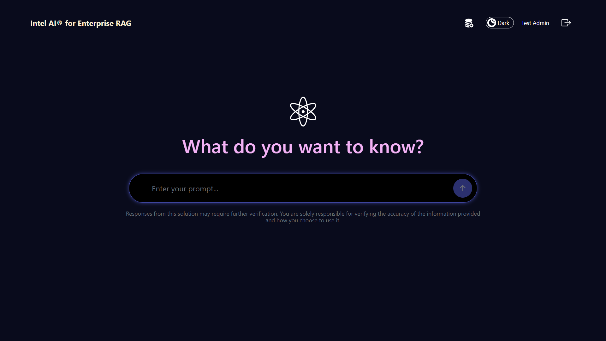

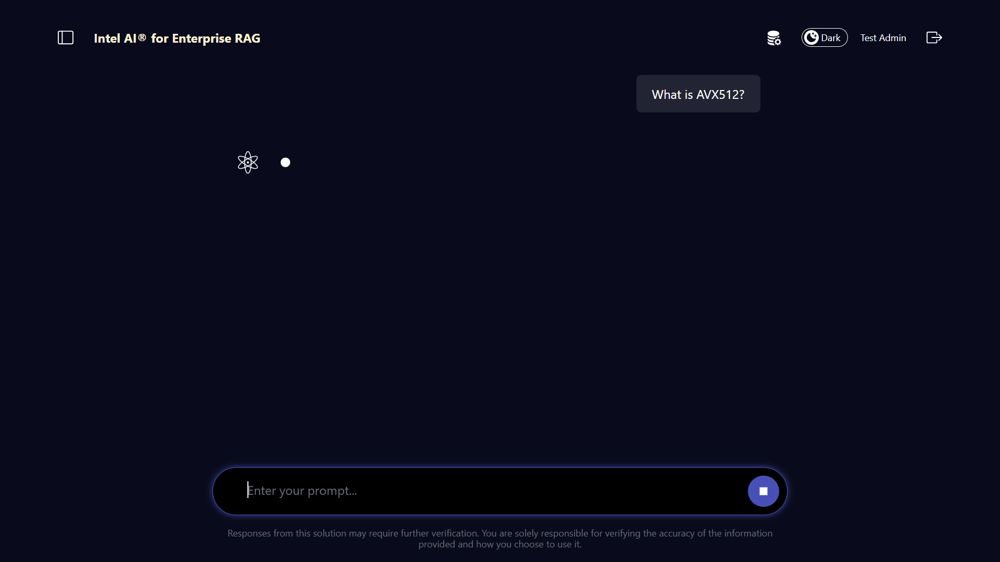

After receiving a message your chat will be saved in Chat History. You can access it by clicking panel icon in the top left corner. Side menu will show up.

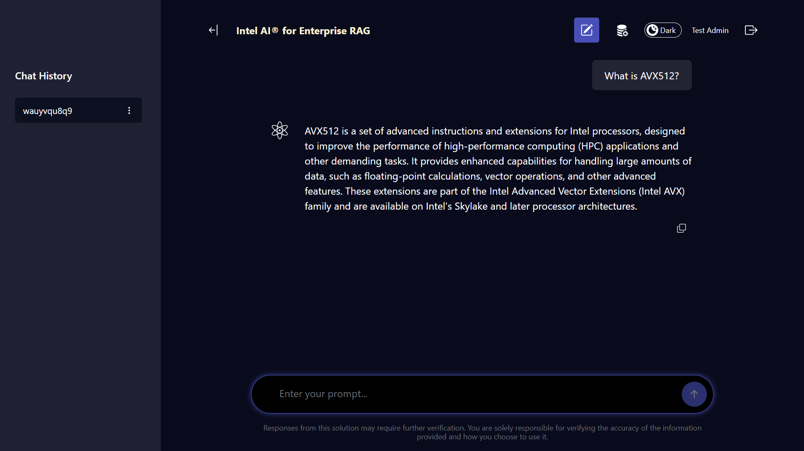

By clicking three dots next to the name of your chat you will see the options to manage your chat. You can rename your chat, export its contents in JSON format and delete it.

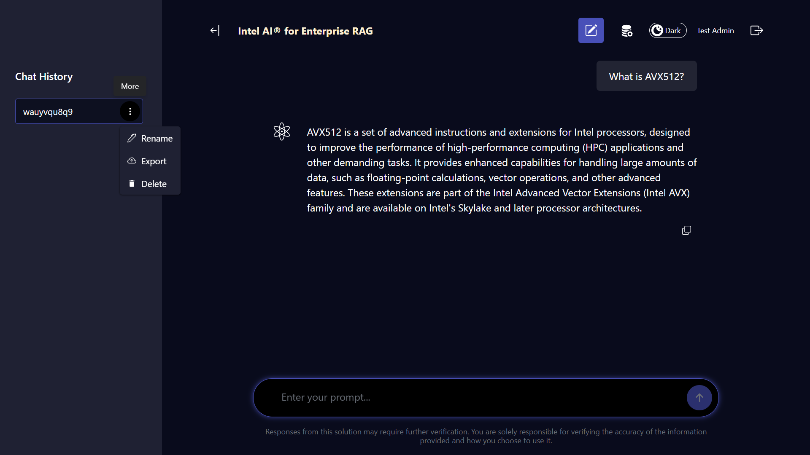

In the top right corner of the page, if you logged in as an admin, you will see three interactive elements - **Admin Panel** button, **Light/Dark Mode** switch and **Logout** button. If you logged in as a regular user, **Admin Panel** button won't be visible for you.

## Admin Panel

In the **Admin Panel** you can access three views using the following tabs: [Control Plane](#control-plane), [Data Ingestion](#data-ingestion) and [Telemetry & Authentication](#telemetry--authentication).

### Control Plane

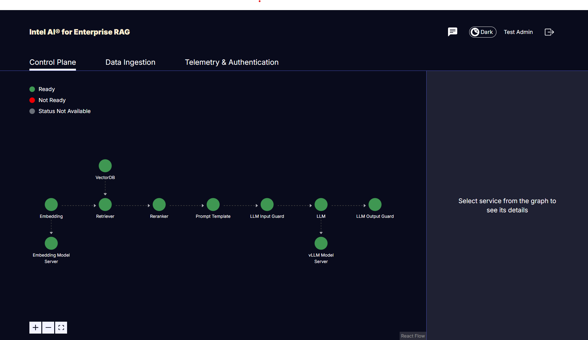

The **Control Plane** view shown above allows the user to see all the components of the currently deployed pipeline as a graph. Each service can be selected from the graph to get further information on the configuration settings of each service. In some components it is also possible to edit service arguments for the services.

For example, when you click on the LLM service, as shown in the screenshot below, the right pane is populated with the LLM parameters that can be modified like `max_new_tokens`, `temperature` etc. To confirm parameters changes, click **Confirm Change** button.

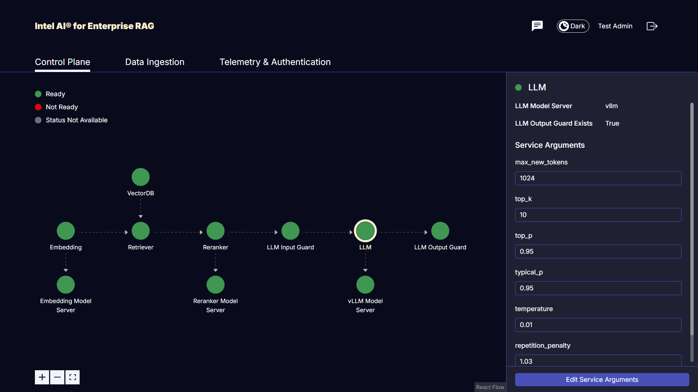

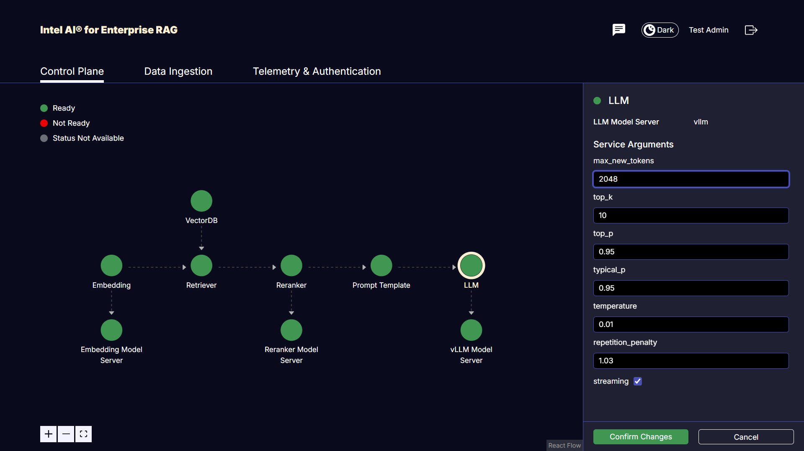

From **Control Plane** view you are also able to change currently used prompt templates by selecting Prompt Template service node from the graph. Edit current prompt templates and click "Confirm Changes" to update them.

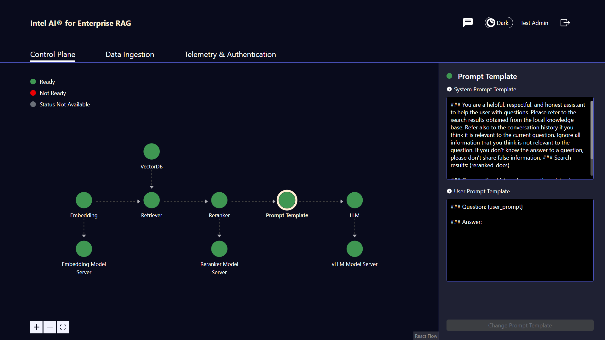

> [!NOTE]
> Prompt Templates cannot be empty and have to contain three placeholders: **{user_prompt}**, **{reranked_docs}** and **{conversation_history}** that can be placed anywhere in both templates once. In case any of these requirements are not met, an error message will be displayed on the screen under text inputs as shown below.

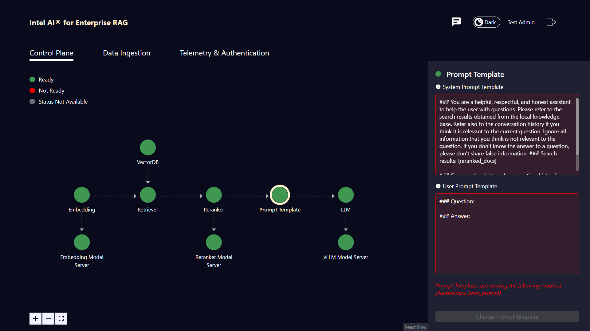

### Data Ingestion

The Admin Panel also has the interface for Data Ingestion as shown below:

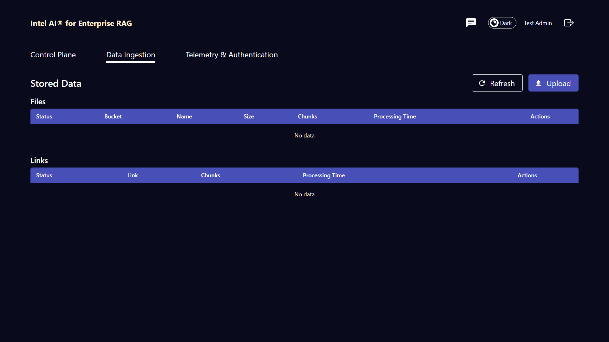

To upload new data, click on **Upload** button. The following dialog will be displayed:

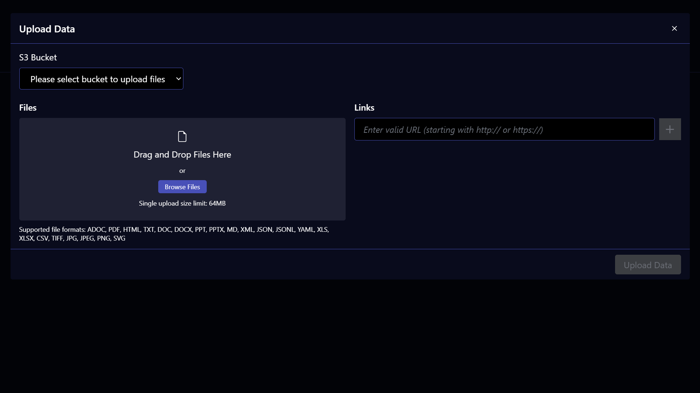

Any file belonging to the supported file format shown in the screenshot or a link to a website can be added to the knowledge base via this interface. Uploading files requires selecting S3 bucket from the select dropdown placed above file input. For links S3 bucket does not have to be selected.

### Telemetry & Authentication

This tab contains links to the other services - Grafana Dashboard and Keycloak Admin Panel. Clicking on one of the visible blocks will open a new tab in your browser with an URL leading to interface of the selected service.

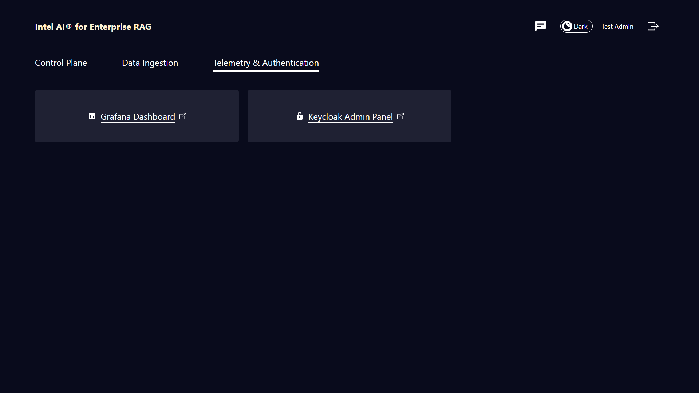
