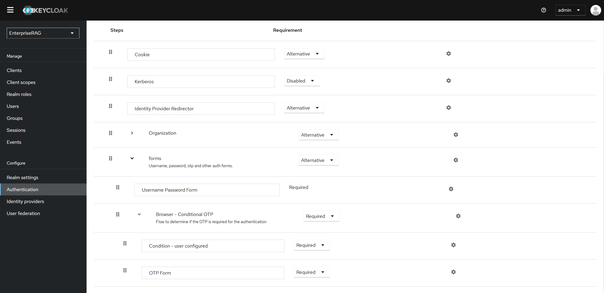
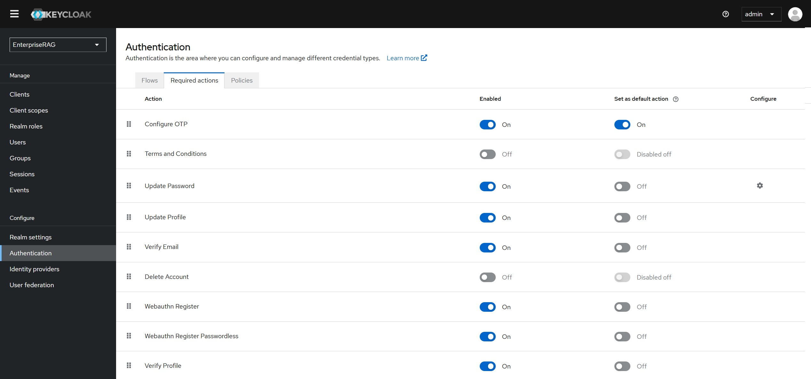
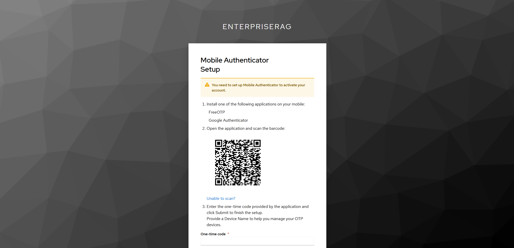

# To Enable Multi-Factor Authentication(MFA) using Google Authenticator in Keycloak

## Verify Keycloak Status

Before proceeding with this guide, verify that the keycloak instance is already up and running 

Log in as admin to the Keycloak Admin Console [keycloak console](https:auth.erag.com) using credentials available in `default_credentials.txt` 

## Enable the OTP (One-Time Password) Form in Authentication Flow

Change Realm to EnterpriseRAG
Navigate to Authentication → Flows.

1. Click on Browser under the Authentication Flows list.
1. In the Authentication Flow tree, look for the "browser Conditional OTP" step.If it is not present, add it by clicking "Add Step" and selecting "Conditional OTP Form".
1. Set the Browser Conditional OTP and OTP Form execution to "REQUIRED".

## Configure OTP Policy

1. Navigate to Authentication → Policies → OTP Policy.
1. Modify the settings as needed:
1. OTP Type: TOTP (Time-based OTP)
1. OTP Hash Algorithm: Choose SHA-256
1. Number of Digits: 6 (default)
1. Look Ahead Window: 1 (default)
1. OTP Token Period: 30 seconds (default)
1. Supported Applications: Ensure `Google Authenticator` is selected.

Click Save.

## Enforce MFA for All Users

1. Navigate to Authentication → Required Actions.
2. Click Configure OTP and set it to "Enabled".
3. Check "Default Action" if you want all users to be required to configure MFA at their next login.(Optional)

Click Save.

## Google Authenticator Setup 
1. Make sure all the above steps are followed already before we validate the below steps.
1. When the next time users log in, they will be prompted to set up an OTP device.
1. Follow the complete instructions for MFA shown in the screen

Once the `Google Authenticator` is setup, it will generate 6 digits code that you need to prompt to login.

