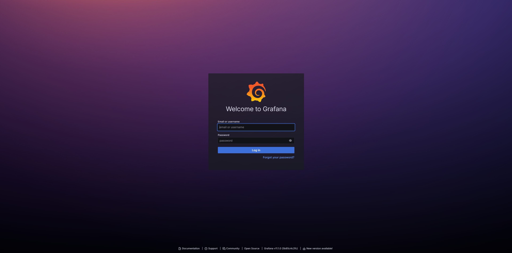
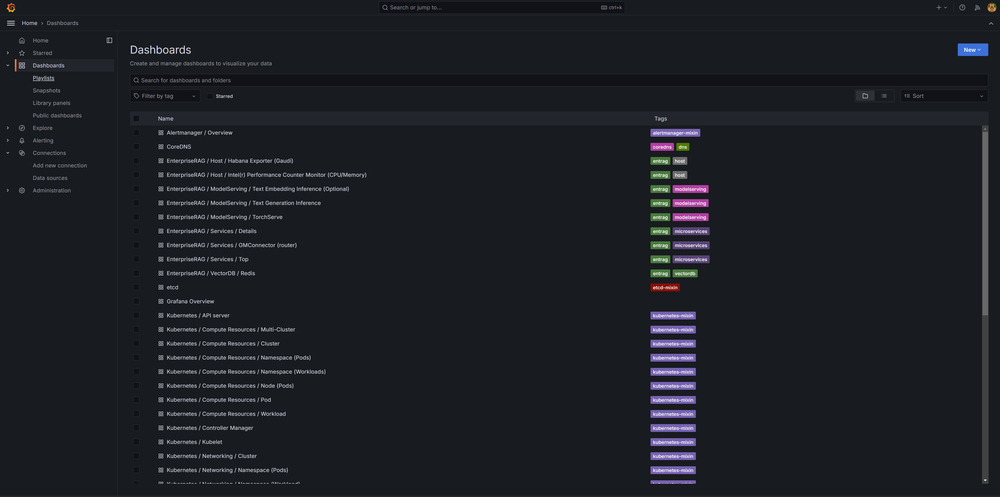

# Enterprise RAG Telemetry

## Validating Access
Enterprise RAG provides telemetry via Grafana dashboards. To access the dashboards, please follow the instructions outlined in the [Deployment README](../deployment/README.md) guide under the `Accessing the UI` section.

Upon visiting `https://grafana.erag.com`, you should observe the following UI layout:

### Dashboards

After logging in, click on `Dashboards` in the left pane. You will see detailed telemetry for all the services in the Enterprise RAG solution:

