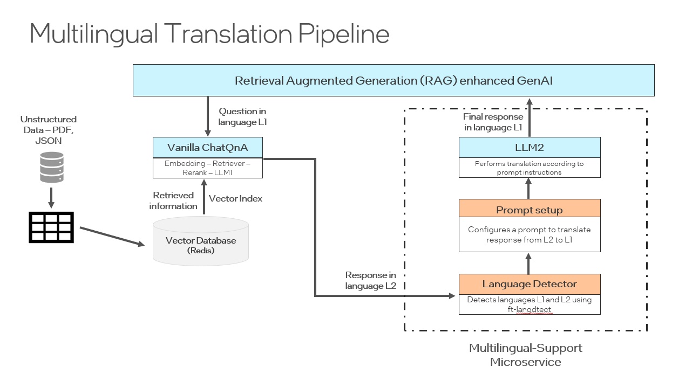

# Language Detection microservice

The Language Detection microservice makes sure that the response of the pipeline is in the same language as that of the query to gurantee seamless, accurate communication across different languages in real time.

# Design Proposal



The Language Detection microservice performs the following actions -
1. It receives the original query as well as the response returned by LLM-1.
2. It detects the language of the user's query (L1) and of the answer from the first llm microservice (L2).
3. It then configures a translation prompt to convert the answer from the response language (L2) to the query language (L1).
4.  This prompt is sent to the second llm microservice (LLM-2) to generate the final answer in language of the user's query (L1).

## Configuration Options

The configuration for the Language Detection Microservice is specified in the [impl/microservice/.env](impl/microservice/.env) file. You can adjust these settings by modifing this dotenv file or by exporting environment variables.

| Environment Variable        | Description                                                                |
|-----------------------------|----------------------------------------------------------------------------|
| `LANGUAGE_DETECTION_USVC_PORT`       | The port of the microservice, by default 8001                              |


## Getting started


### 🚀1. Start Language Detection Microservice with Python (Option 1)

To start the Language Detection microservice, you need to install python packages first.

#### 1.1. Install Requirements

```bash
pip install -r impl/microservice/requirements.txt
```

#### 1.2. Start Microservice

```bash
python opea_language_detection_microservice.py
```

### 🚀2. Start Language Detection Microservice with Docker (Option 2)

#### 2.1. Build the Docker Image:
Navigate to the `src` directory and use the docker build command to create the image:
```bash
cd ../../
docker build -t opea/language_detection:latest -f comps/language_detection/impl/microservice/Dockerfile .
```
Please note that the building process may take a while to complete.

#### 2.2. Run the Docker Container:
```bash
docker run -d --name="language-detection-microservice" \
  --net=host \
  --ipc=host \
  opea/language_detection:latest
```

### 3. Verify the Language Detection Microservice

#### 3.1. Check Status

```bash
curl http://localhost:8001/v1/health_check \
  -X GET \
  -H 'Content-Type: application/json'
```

####  3.2. Sending a Request

The input request consists of the text that has to be translated as well as the first prompt.

**Example Input**

```bash
curl -X POST -H "Content-Type: application/json" -d @- http://localhost:8001/v1/language_detection <<JSON_DATA
{
  "text": "Hi. I am doing fine.",
  "prompt": "### You are a helpful, respectful, and honest assistant to help the user with questions. \
Please refer to the search results obtained from the local knowledge base. \
But be careful to not incorporate information that you think is not relevant to the question. \
If you don't know the answer to a question, please don't share false information. \
### Search results:   \n
### Question: 你好。你好吗？ \n
### Answer:"
}
JSON_DATA
```

**Example Output**

The output contains the prompt that is sent to the second llm microservice which incorporates the detected languages of the response and query.

```json
{
  "id":"1b16e065a1fcbdb4d999fd3d09a619cb",
  "model":null,
  "query":"\n Translate this from English to Chinese:\n   English:\n   Hi. I am doing fine.\n\n  Chinese: \n ",
  "max_new_tokens":1024,
  "top_k":10,"top_p":0.95,
  "typical_p":0.95,
  "temperature":0.01,
  "repetition_penalty":1.03,
  "streaming":false,
  "input_guardrail_params":null,
  "output_guardrail_params":null
}
```


## Additional Information
### Project Structure


The project is organized into several directories:

- `impl/`: This directory contains the implementation of the service. 

- `utils/`: This directory contains utility scripts and modules that are used by the Language Detection Microservice.

The tree view of the main directories and files:

```bash
  .
  ├── impl/
  │   ├── microservice/
  │   │   ├── .env
  │   │   ├── Dockerfile
  │   │   └── requirements.txt
  │   │
  │   │
  │   └── ...
  │
  ├── utils/
  │   ├── opea_language_detection.py
  │   └── prompt.py
      └── detector.py
  │
  ├── README.md
  └── opea_language_detection_microservice.py
```

